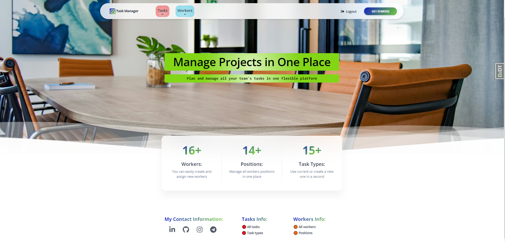
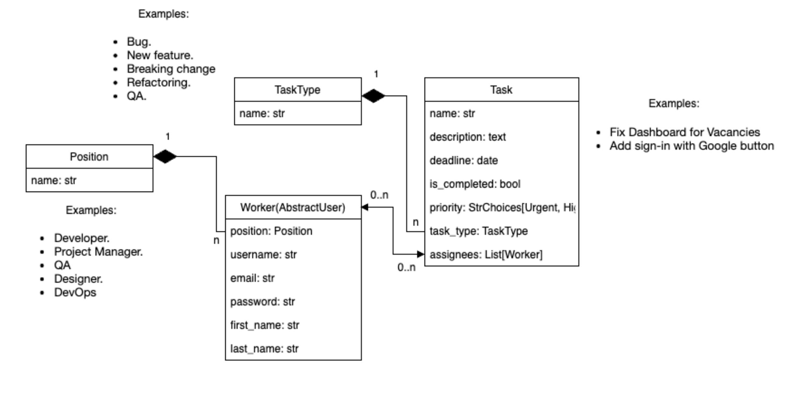
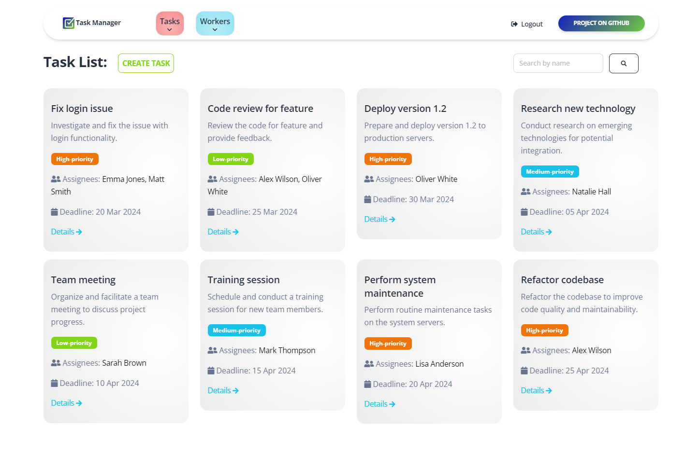
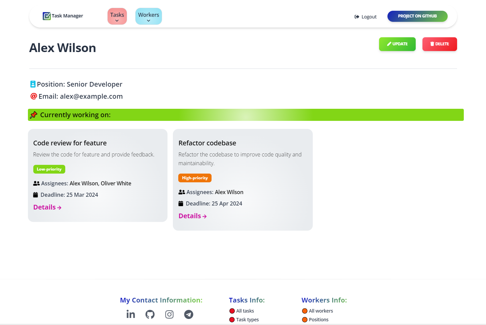
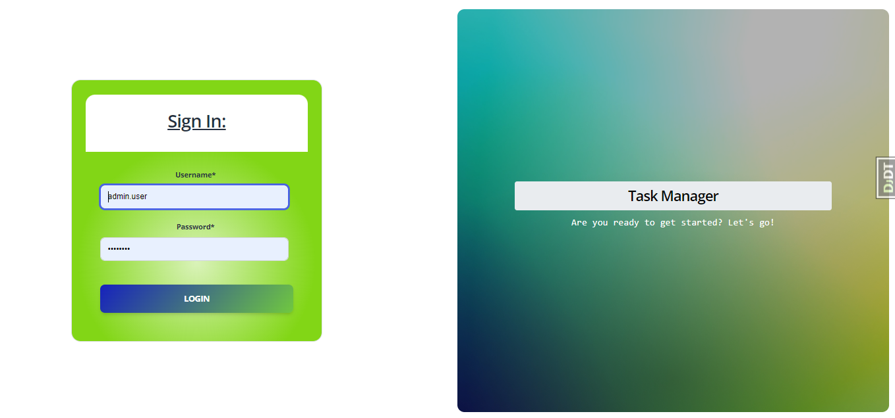
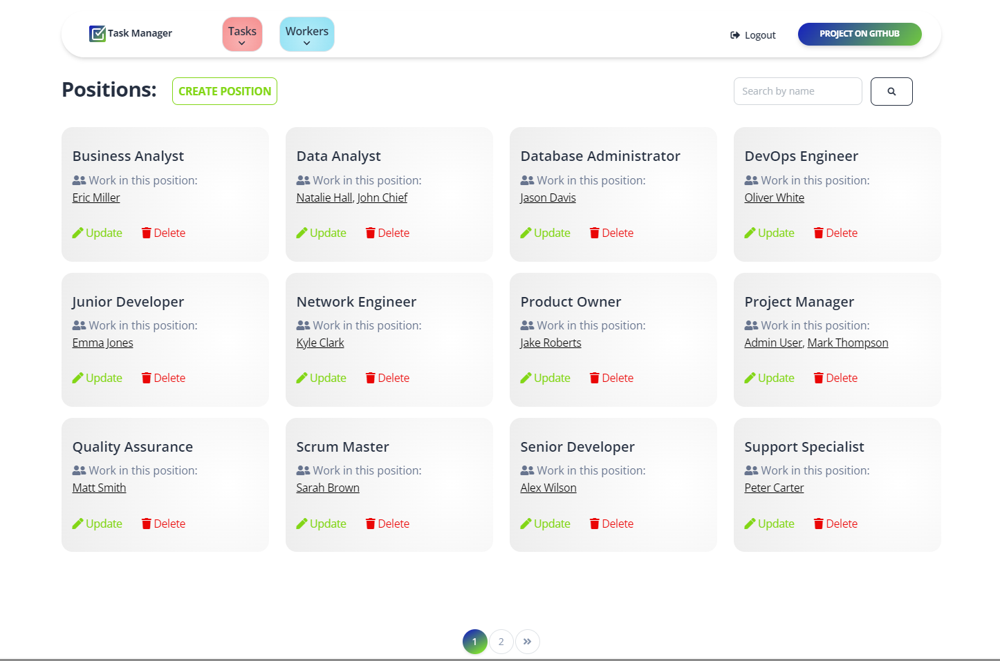
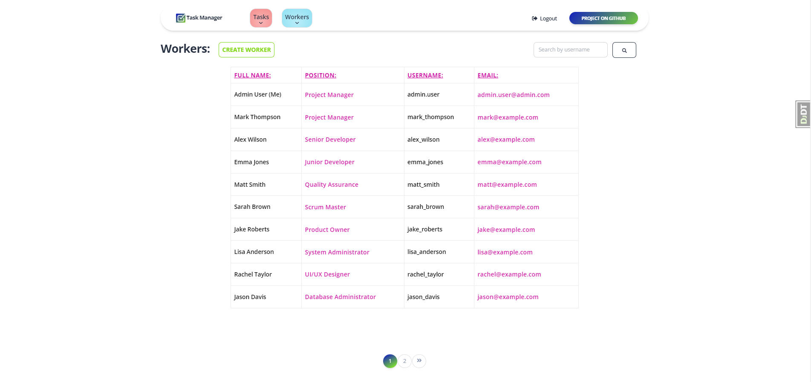

<h1>Task manager for IT company 📆📊📈</h1>

<h3>This project is a task management system for an IT company. It is implemented using the Django framework and provides the ability to create, edit, delete, and view tasks, as well as manage users and their access rights.</h3>

### Home Page (Image):


### I used the free server, [render.com](https://render.com/), so it took some time to upload my project:
### 🔰 [Task Manager project deployed to Render](https://it-company-task-manager-pwni.onrender.com) 🔰
## You can use the following user to log in:

```
login: admin.user
password: 1qazcde3
```
### DB Structure (Image):


## Stages of Project Creation:
<ul>
    <li>Project initialization</li>
    <li>Creating models</li>
    <li>Migrations</li>
    <li>User authentication</li>
    <li>Creating CRUD functionality</li>
    <li>Forms</li>
    <li>Templates and static files</li>
    <li>Widgets and search</li>
    <li>Administration</li>
    <li>Optimization and customization</li>
    <li>Testing</li>
</ul>

### Task List (Image):


## Installation:
<ul>
    <li>You can clone the project to your computer and familiarize yourself with its structure to create something similar.</li>
    <li>However, since the SECRET_KEY, DATABASE_URL, and DEBUG parameters are absent in the final version of the project, it will not work locally.</li>
    <li>Run the following code in the terminal:</li>
</ul>

```
git clone https://github.com/ArtemLeo/it-company-task-manager.git
```

### Random Worker (Image):


## Project Features:
- **User Authentication:** The application allows users to create new accounts, log in, and log out.
- **Task Management:** Users can create, view, update, and delete tasks and task types. Additionally, there is a search function to look up tasks by name.
- **Workers Management:** Users can search for other workers by username and view details of the workers and the tasks they are assigned.
- **Home Page:** Users can view the number of workers, positions, and task types currently created at their company on the application's main page.

### Log In (Image):


## Technologies Used:
- **Django:** for the development of the web framework.
- **SQLite:** for the database.
- **PostgreSQL:** models are also copied additionally to the server.
- **Bootstrap4 (crispy_forms)**: for styling forms.
- **WhiteNoise:** for processing static files.
- **Git:** for version control.


### All Positions (Image):


### All Workers (Image):

