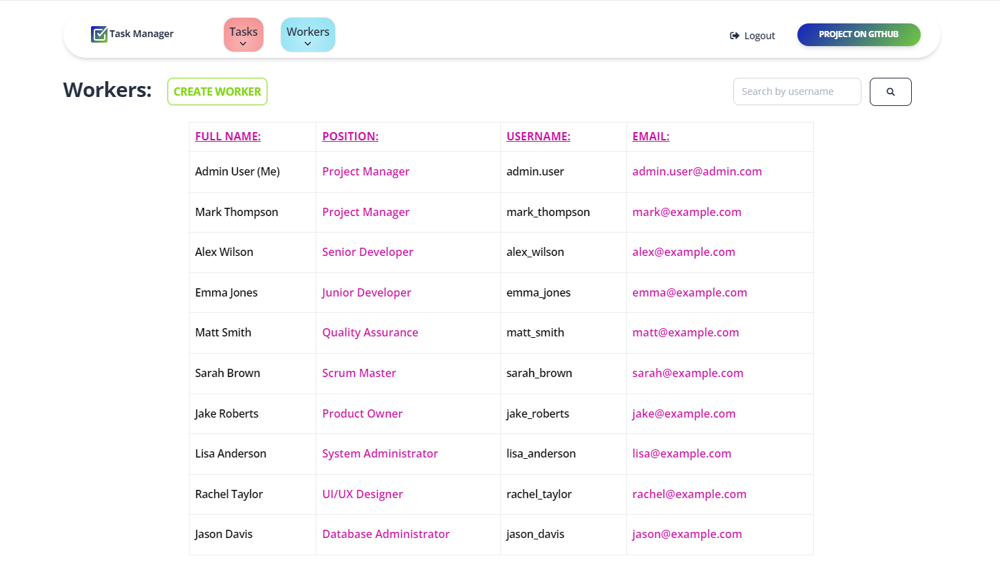

<h1>Task manager for IT company 📆📊📈</h1>

<h3>This project is a task management system for an IT company.</h3>

<ul>
   <li>The application enables users to create, edit, delete, and view tasks.</li>
   <li>It also includes features for managing users and their access rights.</li>
</ul>

### 🏞 Home Page:


### 🌎 I used the free server, [render.com](https://render.com/), so it took some time to upload my project:
### 🔰 [Task Manager project deployed to Render](https://it-company-task-manager-pwni.onrender.com) 🔰

```
You can use the following user to log in:
🔘 login: admin.user
🔘 password: 1qazcde3
```

### 🏞 DB Structure:


## Stages of Project Creation:
<ul>
    <li><strong>Project initialization.</strong></li>
    <li><strong>Creating models.</strong></li>
    <li><strong>Migrations.</strong></li>
    <li><strong>User authentication.</strong></li>
    <li><strong>Creating CRUD functionality.</strong></li>
    <li><strong>Forms.</strong></li>
    <li><strong>Templates and static files.</strong></li>
    <li><strong>Widgets and search.</strong></li>
    <li><strong>Administration.</strong></li>
    <li><strong>Optimization and customization.</strong></li>
    <li><strong>Testing.</strong></li>
</ul>

### 🏞 Task List:


## Installation and Usage:
<ul>
    <li><strong>Python 3.10 must be already installed.</strong></li>
    <li><strong>Clone the repository.</strong></li>
    <li><strong>Set up environment variables using ".env.sample" as a guide.</strong></li>
    <li><strong>Run the application.</strong></li>
    <li><strong>Feel free to explore and contribute!</strong></li>
</ul>


```shell
git clone https://github.com/ArtemLeo/library-service-api.git

(for Windows)
python -m venv venv
source venv/Scripts/activate

(for Mac/Linux)
python3 -m venv venv
source venv/bin/activate

python -m pip install --upgrade pip
pip install -r requirements.txt

set DJANGO_SECRET_KEY=<your django secret key>
set DJANGO_ALLOWED_HOSTS=<your allowed hosts>
set DJANGO_DEBUG=<your debug value>

python manage.py makemigrations
python manage.py migrate
python manage.py runserver
```

### 🏞 Log In:


## Project Features:
- **User Authentication:** The application allows users to create new accounts, log in, and log out.
- **Task Management:** Users can create, view, update, and delete tasks and task types. Additionally, there is a search function to look up tasks by name.
- **Workers Management:** Users can search for other workers by username and view details of the workers and the tasks they are assigned.
- **Home Page:** Users can view the number of workers, positions, and task types currently created at their company on the application's main page.


### 🏞 All Positions:


### 🏞 Random Worker:


### 🏞 All Workers:


## Technologies Used:
- **Django:** for the development of the web framework.
- **SQLite:** for the database.
- **PostgreSQL:** models are also copied additionally to the server.
- **Bootstrap4 (crispy_forms)**: for styling forms.
- **WhiteNoise:** for processing static files.
- **Git:** for version control.